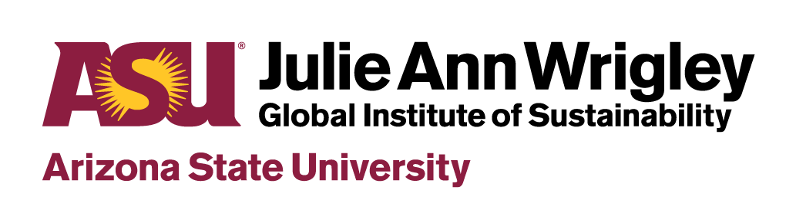

  

<h1 align="center">Sustainability Connect Catalog application using Laravel</h1>

  <b>A PHP Laravel opportunity management application based on the Laravel 5 Boilerplate codebase written by <a href="http://laravel-boilerplate.com/">Rappasoft</a>.</b>

 

### Features

- **Laravel** a web application framework with expressive, elegant syntax. [Documentation](https://laravel.com/docs) available.
- **User Authentication and Access Control** precisely define user roles and permissions, and assign roles and individual permisisons to users to control their access to site features.
- **Third-Party Social Logins - Google, Twitter, Github, etc.** thanks to the awesome annotations of the libraries from [pleerock](https://github.com/pleerock).
- **ASU CAS Logins & ASU Directory (iSearch) Support**.
- **Frontend and Backend Dashboards** themed using the beautiful [CoreUI Bootstrap 4 theme](https://coreui.io/).
- **Full-text, fuzzy search** thanks to [Algolia](https://www.algolia.com/).

## ❯ Table of Contents

- [Getting Started](#-getting-started)
- [Project Structure](#-project-structure)
- [Logging](#-logging)
- [Seeding](#-seeding)
- [Docker](#-docker)
- [Further Documentation](#-further-documentation)
- [Related Projects](#-related-projects)
- [License](#-license)

## ❯ Getting Started

### Step 1: Set up the Development Environment

You need to set up your development environment before you can do anything.

#### Homestead VM

Laravel Homestead is an official, pre-packaged Vagrant box that provides you a development environment without requiring you to install PHP, a web server, and any other server software on your local machine. No more worrying about messing up your operating system. Vagrant boxes are completely disposable. If something goes wrong, you can destroy and re-create the box in minutes.

Instructions on installing Homestead and launching this application are available [here](https://laravel.com/docs/5.8/homestead).

### TO BE CONTINUED